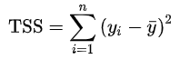

# Stats-Cheatsheet

### 1) One variable regression model

* the best model (choice of coefficients) has the smallest error terms

* residual sum of squares (RSS), also known as the sum of squared residuals (SSR) or the sum of squared estimate of errors (SSE)

 

* total sum of squares (TSS or SST)

 

<b>References:</b> 
https://en.wikipedia.org/wiki/Residual_sum_of_squares 
https://ocw.mit.edu/courses/sloan-school-of-management/15-071-the-analytics-edge-spring-2017/lecture-and-recitation-notes/ 
https://en.wikipedia.org/wiki/Total_sum_of_squares 
